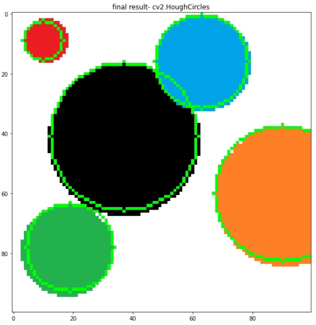

# Hugh Circles

## General Idea: 
- preform CANNY on the picture to find the edges of the object in the picure,
- for every pixel in the image we will create a circle using one point from the edges we found. ( using the formula )
- then we will remove any point that is not in the right size.
- and at last we will match the circles we founc to the original picture.

 

## Explanation
- given the picture we can run the CANNY function that is given in the open cv library, and with the right threshold we can achive very precise edges.
-  
- Run over the dimention of the picture and using the basic formula for a circle r^2 = (x1 - x2)^2 + (y1 -y2)^2
we can create circles using a point from the edge and a point we run at this moment.
this is the results of the matrix and its summed counterpart with threshold deletion.
-  
- Then we will tun another threshold to minimize each point and get a single point in each cluster, each point will be the center of the circle in the original image.
- 
- finaly for each point we got we will create a circle and overlay it with the original picture
-  
